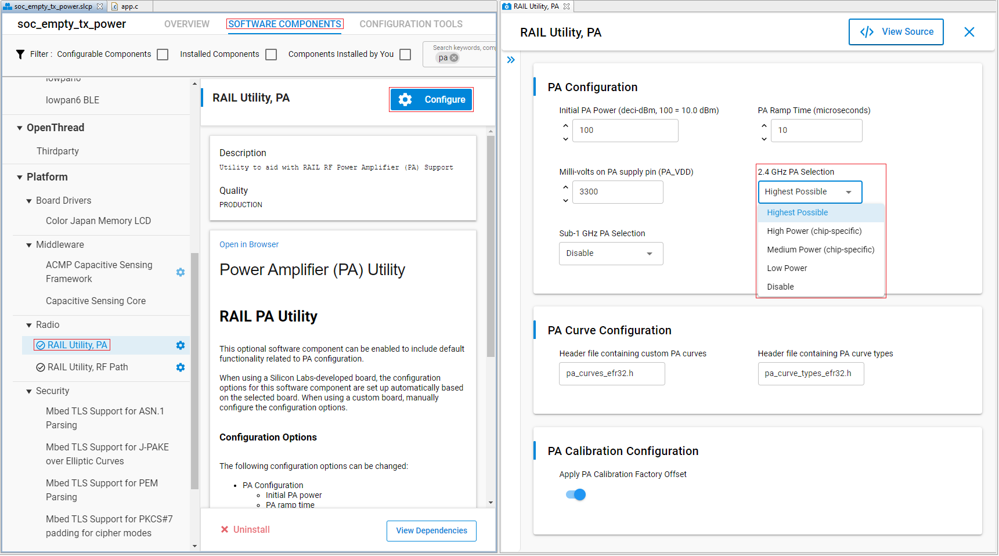
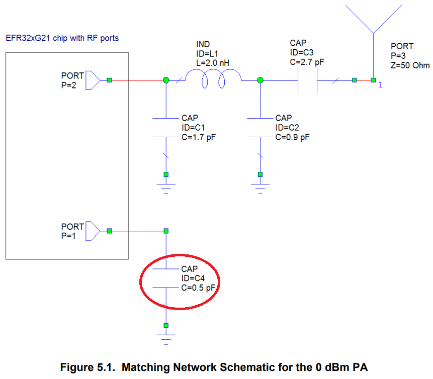
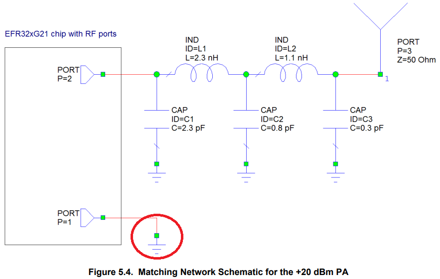
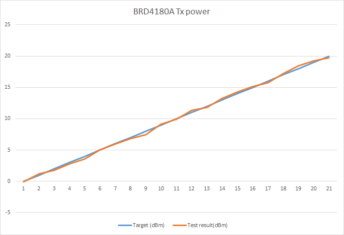
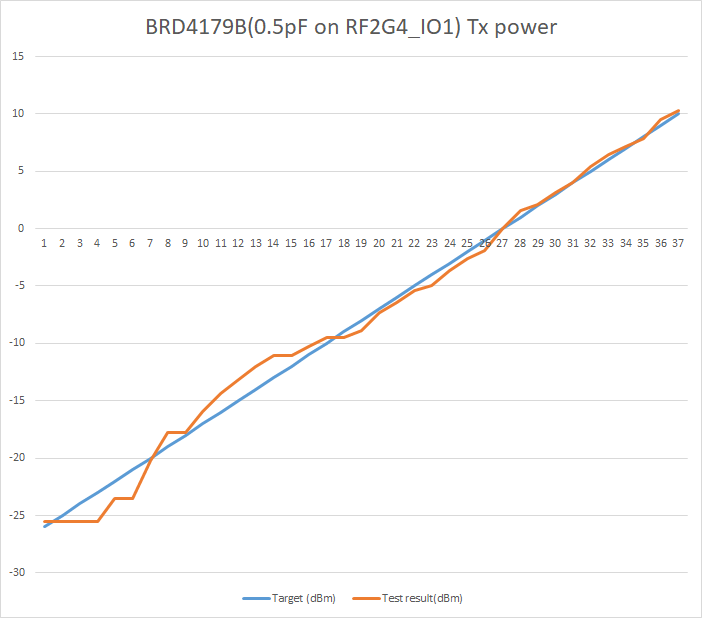

<details>
<summary><font size=5>Table of Contents</font> </summary>

- [1. Introduction](#1-introduction)
- [2. Configure Auto PA Mode](#2-configure-auto-pa-mode)
- [3. Verify](#3-verify)
</details>

# 1. Introduction
The purpose of this article is to share experience on configuring Auto PA switch on BLE and only discuss 2.4GHz PA.  
The EFR32 families of chips each come equipped with two or three Power Amplifiers (PAs):
*  EFR32xG1x  
    * A high-power 2.4 GHz PA (for power 20 dBm and lower)  
    * A low-power 2.4 GHz PA (for power 0 dBm and lower)  
*  EFR32xG21  
    * A high-power 2.4 GHz PA (for power 20 dBm and lower)  
    * A medium-power 2.4 GHz PA (for power 10 dBm and lower)  
    * A low-power 2.4 GHz PA (for power 0 dBm and lower)  
*  EFR32xG22  
    * A high-power 2.4 GHz PA (for power 6 dBm and lower)  
    * A low-power 2.4 GHz PA (for power 0 dBm and lower)  

Each PA maps to different TX output curve.  
While use high-power or medium-power PA, TX power under 0dBm may get a very inaccuracy output.  
While use low-power PA, TX power cannot set above 0dBm.  
In some use case, it needs auto PA switch to insure high accuracy output for both above and below 0dBm. 

# 2. Configure-Auto-PA-Mode
Currently, Auto PA mode need customize in application code.  
PA mode can be configured in config\sl_bluetooth_config.h
```
#define BT_PA_SELECTION                SL_RAIL_UTIL_PA_SELECTION_2P4GHZ

#define SL_BT_CONFIG_DEFAULT                                                   \
  {                                                                            \
    .config_flags = SL_BT_CONFIG_FLAGS,                                        \
    .bluetooth.max_connections = SL_BT_CONFIG_MAX_CONNECTIONS_SUM,             \
    .bluetooth.max_advertisers = SL_BT_CONFIG_MAX_ADVERTISERS,                 \
    .bluetooth.max_periodic_sync = SL_BT_CONFIG_MAX_PERIODIC_ADVERTISING_SYNC, \
    .bluetooth.max_buffer_memory = SL_BT_CONFIG_BUFFER_SIZE,                   \
    .scheduler_callback = SL_BT_CONFIG_LL_CALLBACK,                            \
    .stack_schedule_callback = SL_BT_CONFIG_STACK_CALLBACK,                    \
    .gattdb = &gattdb,                                                         \
    .max_timers = SL_BT_CONFIG_MAX_SOFTWARE_TIMERS,                            \
    .rf.tx_gain = SL_BT_CONFIG_RF_PATH_GAIN_TX,                                \
    .rf.rx_gain = SL_BT_CONFIG_RF_PATH_GAIN_RX,                                \
    .rf.tx_min_power = SL_BT_CONFIG_MIN_TX_POWER,                              \
    .rf.tx_max_power = SL_BT_CONFIG_MAX_TX_POWER,                              \
    .pa.config_enable = BT_PA_CONFIG_STATE,                                    \
    .pa.input = BT_PA_POWER_SUPPLY,                                            \
    .pa.pa_mode = BT_PA_SELECTION,                                             \
  }
```
In fixed PA mode these below PA mode can be configured.
config\sl_rail_util_pa_config.h
```
#define SL_RAIL_UTIL_PA_SELECTION_2P4GHZ    RAIL_TX_POWER_MODE_2P4GIG_HIGHEST
```
gecko_sdk_3.2.2\platform\radio\rail_lib\chip\efr32\efr32xg2x\rail_chip_specific.h
```
RAIL_TX_POWER_MODE_2P4GIG_HP,
RAIL_TX_POWER_MODE_2P4GIG_MP,
RAIL_TX_POWER_MODE_2P4GIG_LP,
RAIL_TX_POWER_MODE_2P4GIG_HIGHEST,
RAIL_TX_POWER_MODE_NONE,
```
This config can handle UGI, change the config then it will auto generate relevant code.  
<div align="left">
  
</div> 

## Auto PA Mode Enable
Change the PA mode to SL_BT_BLUETOOTH_PA_AUTOMODE, in config\sl_bluetooth_config.h
```
    .pa.pa_mode = SL_BT_BLUETOOTH_PA_AUTOMODE,
```
SL_BT_BLUETOOTH_PA_AUTOMODE is define as 0xFF in gecko_sdk_3.2.2\protocol\bluetooth\inc\sl_bt_ll_config.h
```
#define SL_BT_BLUETOOTH_PA_AUTOMODE 0xff
```
## Auto PA Mode Customize
Re-write RAILCb_PaAutoModeDecision() in somewhere, it can put into app.c  
For more information about RAILCb_PaAutoModeDecision() please refer to [docs link](https://docs.silabs.com/rail/2.11/group-p-a#ga286e52377bd055d3bd8fd017e3814b8f)  
```
#include "rail.h"

RAIL_Status_t RAILCb_PaAutoModeDecision(RAIL_Handle_t railHandle,
                                        RAIL_TxPower_t *power,
                                        RAIL_TxPowerMode_t *mode,
                                        const RAIL_ChannelConfigEntry_t *chCfgEntry)
{  
  if(*power < 0) {
    // Use the LP PA when is below 0dBm
    *mode = RAIL_TX_POWER_MODE_2P4GIG_LP;
  } else if((*power >= 0) && (*power <= 100)) {
    // Use the MP PA when TX power is from 0dBm to 10dBm
    *mode = RAIL_TX_POWER_MODE_2P4GIG_MP;
  } else {
    // Use the HP PA when TX power is over 10dBm
    *mode = RAIL_TX_POWER_MODE_2P4GIG_HP;
  }
  return RAIL_STATUS_NO_ERROR;
}

```
# 3. Verify
To verify if Auto PA mode work, we can confirm it in two ways, API return value and measure by Spectrum Analyzer.  
## Check With API
Customize a test code, set specify TX power by sl_bt_system_set_tx_power(),   
log and compare the target setting and the setting that return by API.  
The setting value returned by the API is the setting value to be implemented by the BLE stack.  
Here list up target setting and return setting for each PA mode.  
Here only focus on -26dBm to 20dBm.  
Unit: 0.1 dBm. For example, the value 10 means 1 dBm.  

High-power PA
```
Bluetooth stack booted: v3.2.2-b267
Bluetooth public device address: 00:0D:6F:0A:46:A0
------------------------Start-------------------------
set_tx_power(-260) returns -260
set_tx_power(-250) returns -260
set_tx_power(-240) returns -260
set_tx_power(-230) returns -260
set_tx_power(-220) returns -260
set_tx_power(-210) returns -260
set_tx_power(-200) returns -260
set_tx_power(-190) returns -260
set_tx_power(-180) returns -260
set_tx_power(-170) returns -155
set_tx_power(-160) returns -155
set_tx_power(-150) returns -155
set_tx_power(-140) returns -155
set_tx_power(-130) returns -113
set_tx_power(-120) returns -113
set_tx_power(-110) returns -113
set_tx_power(-100) returns -113
set_tx_power(-90) returns -72
set_tx_power(-80) returns -72
set_tx_power(-70) returns -63
set_tx_power(-60) returns -63
set_tx_power(-50) returns -46
set_tx_power(-40) returns -46
set_tx_power(-30) returns -24
set_tx_power(-20) returns -24
set_tx_power(-10) returns -13
set_tx_power(000) returns -03
set_tx_power(010) returns 009
set_tx_power(020) returns 021
set_tx_power(030) returns 027
set_tx_power(040) returns 039
set_tx_power(050) returns 051
set_tx_power(060) returns 059
set_tx_power(070) returns 070
set_tx_power(080) returns 074
set_tx_power(090) returns 089
set_tx_power(100) returns 101
set_tx_power(110) returns 111
set_tx_power(120) returns 118
set_tx_power(130) returns 130
set_tx_power(140) returns 140
set_tx_power(150) returns 150
set_tx_power(160) returns 160
set_tx_power(170) returns 170
set_tx_power(180) returns 180
set_tx_power(190) returns 190
set_tx_power(200) returns 200
-----------------------End-------------------------
```
Medium-power PA
```
Bluetooth stack booted: v3.2.2-b267
Bluetooth public device address: 00:0D:6F:0A:46:A0
------------------------Start-------------------------
set_tx_power(-260) returns -260
set_tx_power(-250) returns -260
set_tx_power(-240) returns -260
set_tx_power(-230) returns -260
set_tx_power(-220) returns -260
set_tx_power(-210) returns -260
set_tx_power(-200) returns -260
set_tx_power(-190) returns -260
set_tx_power(-180) returns -260
set_tx_power(-170) returns -260
set_tx_power(-160) returns -144
set_tx_power(-150) returns -144
set_tx_power(-140) returns -144
set_tx_power(-130) returns -144
set_tx_power(-120) returns -96
set_tx_power(-110) returns -96
set_tx_power(-100) returns -96
set_tx_power(-90) returns -96
set_tx_power(-80) returns -96
set_tx_power(-70) returns -74
set_tx_power(-60) returns -57
set_tx_power(-50) returns -57
set_tx_power(-40) returns -40
set_tx_power(-30) returns -29
set_tx_power(-20) returns -19
set_tx_power(-10) returns -09
set_tx_power(000) returns 001
set_tx_power(010) returns 011
set_tx_power(020) returns 017
set_tx_power(030) returns 029
set_tx_power(040) returns 041
set_tx_power(050) returns 051
set_tx_power(060) returns 061
set_tx_power(070) returns 070
set_tx_power(080) returns 080
set_tx_power(090) returns 090
set_tx_power(100) returns 100
set_tx_power(110) returns 100
set_tx_power(120) returns 100
set_tx_power(130) returns 100
set_tx_power(140) returns 100
set_tx_power(150) returns 100
set_tx_power(160) returns 100
set_tx_power(170) returns 100
set_tx_power(180) returns 100
set_tx_power(190) returns 100
set_tx_power(200) returns 100
-----------------------End-------------------------
```
Low-power PA
```
Bluetooth stack booted: v3.2.2-b267
Bluetooth public device address: 00:0D:6F:0A:46:A0
------------------------Start-------------------------
set_tx_power(-260) returns -260
set_tx_power(-250) returns -246
set_tx_power(-240) returns -246
set_tx_power(-230) returns -231
set_tx_power(-220) returns -215
set_tx_power(-210) returns -215
set_tx_power(-200) returns -200
set_tx_power(-190) returns -184
set_tx_power(-180) returns -184
set_tx_power(-170) returns -169
set_tx_power(-160) returns -154
set_tx_power(-150) returns -154
set_tx_power(-140) returns -138
set_tx_power(-130) returns -123
set_tx_power(-120) returns -123
set_tx_power(-110) returns -108
set_tx_power(-100) returns -92
set_tx_power(-90) returns -92
set_tx_power(-80) returns -77
set_tx_power(-70) returns -68
set_tx_power(-60) returns -60
set_tx_power(-50) returns -48
set_tx_power(-40) returns -39
set_tx_power(-30) returns -29
set_tx_power(-20) returns -19
set_tx_power(-10) returns -09
set_tx_power(000) returns -06
set_tx_power(010) returns -06
set_tx_power(020) returns -06
set_tx_power(030) returns -06
set_tx_power(040) returns -06
set_tx_power(050) returns -06
set_tx_power(060) returns -06
set_tx_power(070) returns -06
set_tx_power(080) returns -06
set_tx_power(090) returns -06
set_tx_power(100) returns -06
set_tx_power(110) returns -06
set_tx_power(120) returns -06
set_tx_power(130) returns -06
set_tx_power(140) returns -06
set_tx_power(150) returns -06
set_tx_power(160) returns -06
set_tx_power(170) returns -06
set_tx_power(180) returns -06
set_tx_power(190) returns -06
set_tx_power(200) returns -06
-----------------------End-------------------------
```
When using a High-power PA or a Medium-power PA, there is a large deviation from about -18dBm, and a Low-power PA cannot obtain a transmit power exceeding 0dBm.

Now check the log data when using Auto PA switch mode. Compared with the log data of the above 3 PA modes, the API returns are merged.  
Use Low-power PA below 0dBm, medium-power PA from 0dBm to 10dBm, and high-power PA above 10dBm.  
This makes it possible to obtain high-precision TX power in the full power range.  
```
Bluetooth stack booted: v3.2.2-b267
Bluetooth public device address: 00:0D:6F:0A:46:A0
------------------------Start-------------------------
set_tx_power(-260) returns -260
set_tx_power(-250) returns -246
set_tx_power(-240) returns -246
set_tx_power(-230) returns -231
set_tx_power(-220) returns -215
set_tx_power(-210) returns -215
set_tx_power(-200) returns -200
set_tx_power(-190) returns -184
set_tx_power(-180) returns -184
set_tx_power(-170) returns -169
set_tx_power(-160) returns -154
set_tx_power(-150) returns -154
set_tx_power(-140) returns -138
set_tx_power(-130) returns -123
set_tx_power(-120) returns -123
set_tx_power(-110) returns -108
set_tx_power(-100) returns -92
set_tx_power(-90) returns -92
set_tx_power(-80) returns -77
set_tx_power(-70) returns -68
set_tx_power(-60) returns -60
set_tx_power(-50) returns -48
set_tx_power(-40) returns -39
set_tx_power(-30) returns -29
set_tx_power(-20) returns -19
set_tx_power(-10) returns -09
set_tx_power(000) returns 001
set_tx_power(010) returns 011
set_tx_power(020) returns 017
set_tx_power(030) returns 029
set_tx_power(040) returns 041
set_tx_power(050) returns 051
set_tx_power(060) returns 061
set_tx_power(070) returns 070
set_tx_power(080) returns 080
set_tx_power(090) returns 090
set_tx_power(100) returns 100
set_tx_power(110) returns 111
set_tx_power(120) returns 118
set_tx_power(130) returns 130
set_tx_power(140) returns 140
set_tx_power(150) returns 150
set_tx_power(160) returns 160
set_tx_power(170) returns 170
set_tx_power(180) returns 180
set_tx_power(190) returns 190
set_tx_power(200) returns 200
-----------------------End-------------------------
```
## Check With Spectrum Analyzer
Since we currently don't have a radio board that supports the full range of TX power.  
For 0dBm antenna network matching, we need to rework, since 0dBm PA requires 0.5 pF capacitance.  
BRD4180A is not suitable for rework on this due to its PCB layout.  
BRD4179B can do, but it only support up to 10dBm TX power.  
So we use 2 radio boards for test.

<div align="left">
  
</div>

<div align="left">
  
</div>

According to [AN930.2](https://www.silabs.com/documents/public/application-notes/an930.2-efr32-series-2.pdf), an additional 0.5 pF capacitor on RF2G4_IO1 is needed when enable the usage of the 0 dBm PA.  
Unlike the 10 dBm and 20 dBm PA, the 0 dBm PA requires the two RF ports to be blocked at DC.  
In the original 20 dBm PA matching, it connects the unused RF pin is directly to GND.  
Enabling the 0 dBm PA in this configuration could even cause damage to the chip.  
Thus the additional 0.5 pF capacitor on RF2G4_IO1 is needed to overcome this issue.  

### Test condition list as below.  
Radio board: BRD4180A(0dBm to 20dBm), BRD4179B(-26dBm to 10dBm)  
Tester:  Agilent E4405B spectrum analyzer  
Config: Frequency=2440MHz, Span=2MHz, Amplitude ref=20dBm, Amplitude offset=1.6dB    
Packet type: sl_bt_test_pkt_11111111  

### Test result list as below.  
**BRD4180A**
|Target(dBm)|Test result(dBm)|Delta(dB)|
|:----:|:----:|:----:|
|0|-0.08|-0.08|
|1|1.176|0.176|
|2|1.736|-0.264|
|3|2.748|-0.252|
|4|3.596|-0.404|
|5|4.965|-0.035|
|6|5.969|-0.031|
|7|6.859|-0.141|
|8|7.484|-0.516|
|9|9.095|0.095|
|10|9.923|-0.077|
|11|11.36|0.36|
|12|11.85|-0.15|
|13|13.23|0.23|
|14|14.25|0.25|
|15|15.1|0.1|
|16|15.75|-0.25|
|17|17.23|0.23|
|18|18.43|0.43|
|19|19.23|0.23|
|20|19.73|-0.27|

<div align="left">
  
</div> 

**BRD4179B(0.5pF on RF2G4_IO1)**
|Target(dBm)|Test result(dBm)|Delta(dB)|
|:----:|:----:|:----:|
|-26|-25.53|0.47|
|-25|-25.53|-0.53|
|-24|-25.53|-1.53|
|-23|-25.53|-2.53|
|-22|-23.54|-1.54|
|-21|-23.54|-2.54|
|-20|-20.22|-0.22|
|-19|-17.8|1.2|
|-18|-17.8|0.2|
|-17|-15.91|1.09|
|-16|-14.39|1.61|
|-15|-14.39|0.61|
|-14|-12.03|1.97|
|-13|-11.08|1.92|
|-12|-11.08|0.92|
|-11|-10.26|0.74|
|-10|-9.515|0.485|
|-9|-9.499|-0.499|
|-8|-8.878|-0.878|
|-7|-7.279|-0.279|
|-6|-6.442|-0.442|
|-5|-5.429|-0.429|
|-4|-4.927|-0.927|
|-3|-3.639|-0.639|
|-2|-2.637|-0.637|
|-1|-1.946|-0.946|
|0|0.0282|0.0282|
|1|1.565|0.565|
|2|2.12|0.12|
|3|3.11|0.11|
|4|4.004|0.004|
|5|5.393|0.393|
|6|6.425|0.425|
|7|7.188|0.188|
|8|7.846|-0.154|
|9|9.494|0.494|
|10|10.28|0.28|

<div align="left">
  
</div> 

## Test Code
[soc_empty_tx_power.sls](files/soc_empty_tx_power.sls)  
It base on Bluetooth 3.2.2, there 2 macro in app.c for function and board selection.  
```
#define D_DTM     //comment it out while only check the API return value
```
If define, use for check TX power by Spectrum Analyzer. Otherwise, check by API.  
```
#define D_BRD4180A  //comment it out while using BRD4179B
```
If define, test on BRD180A, otherwise it should test on BRD4179B.  

